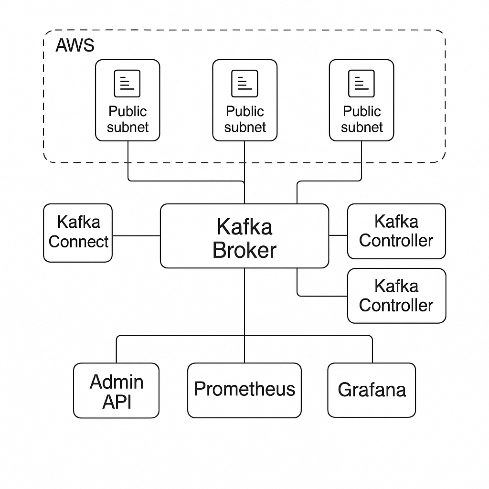

# Trendyol Data Streaming Case – Runbook

Bu dosya, case kapsamında yaptığım tüm adımların uçtan uca nasıl çalıştığını özetler.  
Adımları sade ve net biçimde ilerlettim.

      Bu çalışma, aws maliyet yaratmamak adına Terraform apply uygulanmadan hazırlanmıştır. Tüm kaynak tanımları eksiksizdir ve plan çıktısı çalışır durumdadır. Request halinde apply yapılacak altyapı hazırdır.
---

## 1) Terraform ile Infra Hazırlığı

- VPC oluşturdum (10.20.0.0/16)
- 3 adet public subnet açtım (eu-central-1a, 1b, 1c)
- Internet Gateway + Route Table bağladım
- Security Group oluşturdum (challenge için şimdilik tüm açık)
- Compute modülü:
  - 4 broker node
  - 3 controller node
  - 1 connect node
  - 1 observability node
- Module outputs’a gerekli IP'leri ekledim

### Komutlar

cd terraform/envs/prod
terraform init
terraform apply

çıktıdan ip’leri aldım. inventory scriptine ekleyip ansible için hazırladım.

> Not: SG artık sadece gereken portları açıyor (22, 9092/9093, 9100, 5555/5556, 7777/7778, 8083/8084, 2020). Key olarak `challenge-key` bekliyor, user-data basit apt update yapıyor. Backend S3 tanımlı.

## 2) Ansible ile Kafka kurulumu (cp-ansible)

- inventory dosyasını terraform output ile doldurmak için script yazdım
- cp-ansible requirements ekledim
- kafka broker ve controller rollerini playbook’a koydum
- ayarları group_vars/all.yml içine yazdım

ansible-playbook -i ansible/inventory/hosts.ini ansible/playbooks/kafka.yml

> Not: `ansible/playbooks/certs.yml` self-signed keystore/truststore üretiyor (demo). Gerçekte CA/vault ile değiştirmek lazım. Rack bilgisi inventory’den geliyor.

## 3) Observability

- prometheus için skeleton dosyası bıraktım
- alertmanager iskeleti koydum
- grafana klasörü açtım, dashboardları sonra ekleyeceğim
- hepsi observability ec2 üstünde çalışacak

## 4) Admin API

- flask ile api klasörü açtım
- dockerfile yazdım
- requirementları ekledim
- ping endpoint ile başladım, sonra adminclient fonksiyonlarını koyacağım

## 5) Kafka Connect

- docker-compose ile connect nodeunu hazırladım
- http source plugin için plugins klasörünü oluşturdum
- bootstrap ip’yi sonra terraform output’tan alıp compose içinde güncelleyeceğim

## 6) Admin API (Flask + AdminClient)

- api klasorunu actim
- requirements.txt icine confluent-kafka ve flask ekledim
- dockerfile yazdim
- app.py icine brokers/topics/consumer-groups icin endpointleri koydum
- uygulama 2020 portunda calisiyor
- kafka baglantisini env ile yapiyorum:
  KAFKA_BOOTSTRAP_SERVERS="1.2.3.4:9092"

calistirmak icin:

docker build -t admin-api .
docker run -p 2020:2020 -e KAFKA_BOOTSTRAP_SERVERS="IP:9092" admin-api

## 7) Kafka Connect

- docker-compose ile connect nodeunu ayaga kaldirdim
- plugin klasoru actim (http source icin)
- connector config dosyasini ekledim (connect/config/http-source.json)

connector yaratma:

## 7) Kafka Connect

- docker-compose ile connect nodeunu ayaga kaldirdim
- plugin klasoru actim (http source icin)
- connector config dosyasini ekledim (connect/config/http-source.json)

connector yaratma:
curl -X POST -H "Content-Type: application/json"
--data @connect/config/http-source.json
http://CONNECT_IP:8083/connectors

durum:
curl http://CONNECT_IP:8083/connectors/http-source-1/status

listeleme:
curl http://CONNECT_IP:8083/connectors

silme:
curl -X DELETE http://CONNECT_IP:8083/connectors/http-source-1

## 8) Observability (Prometheus + Alertmanager + Grafana)

- observability ec2 uzerinde prometheus, alertmanager ve grafana calistiriyorum
- prometheus.yml baslangicta bos targetliydi
- terraform outputlarindan ip'leri alip prometheus dosyasina target olarak yazan script yazdim:

scripts/update_prometheus_targets.sh
- node exporter butun ec2'lerde systemd servisi olarak calisacak
- kafka broker ve controller icin jmx exporter portlarini ansible ile acacagim
- connect icin de jmx portu expose edecegim

Prometheus baslatma:
./prometheus --config.file=prometheus.yml

Grafana baslatma:
./grafana-server

Alertmanager baslatma:
./alertmanager --config.file=alertmanager.yml

### Connector yaratma

curl -X POST http://CONNECT_IP:8083/connectors
-H "Content-Type: application/json"
-d @connect/config/http-source.json

### Connector listeleme
curl http://CONNECT_IP:8083/connectors

### Connector detay
curl http://CONNECT_IP:8083/connectors/http-source-1

### Connector status
curl http://CONNECT_IP:8083/connectors/http-source-1/status

### Connector tasks
curl http://CONNECT_IP:8083/connectors/http-source-1/tasks

### Task status

curl http://CONNECT_IP:8083/connectors/http-source-1/tasks/0/status

### Task restart

curl -X POST http://CONNECT_IP:8083/connectors/http-source-1/tasks/0/restart

### Connector silme
curl -X DELETE http://CONNECT_IP:8083/connectors/http-source-1

### Bootstrap server ip’yi compose icine ekleme

terraform output:
terraform -chdir=terraform/envs/prod output broker_ips

ilk broker ip’sini alıyorum, ör:
1.2.3.4

docker-compose.yml içinde:
CONNECT_BOOTSTRAP_SERVERS="PLAINTEXT://1.2.3.4:9092"

### Hızlı test notları
- Admin API:
  - `curl -X POST localhost:2020/topics -H "Content-Type: application/json" -d '{"name":"topic-1","num_partitions":3,"replication_factor":3}'`
  - `curl localhost:2020/brokers`, `curl localhost:2020/topics`, `curl localhost:2020/topics/topic-1`
  - `curl localhost:2020/consumer-groups`, `curl localhost:2020/consumer-groups/<group>`
- Connect:
  - `cd connect/docker && ./plugins/fetch_http_source.sh` (internet gerekir)
  - `docker-compose up -d`
  - `curl -X POST -H "Content-Type: application/json" --data @../config/http-source.json http://CONNECT_IP:8083/connectors`
  - `curl http://CONNECT_IP:8083/connectors/http-source-1/status`
- Prometheus targetlarını doldurmak:
  - `./scripts/update_prometheus_targets.sh` (Python kullanıyor, sed farkı yok)
  - `observability/prometheus/prometheus.yml` içinde job’lar otomatik yazılır
